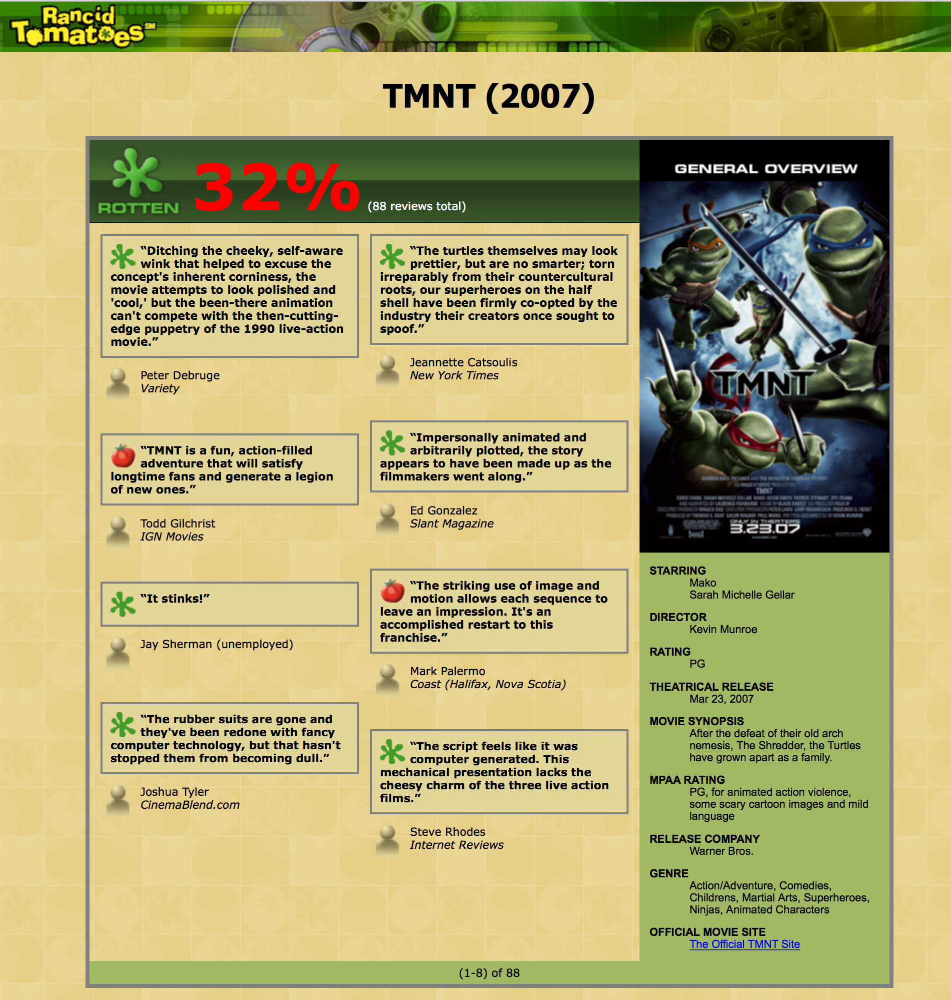
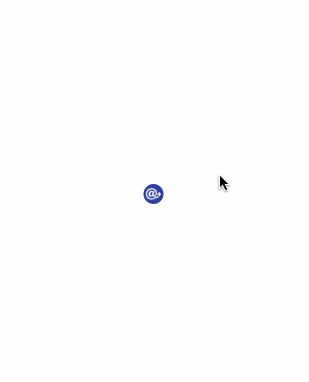
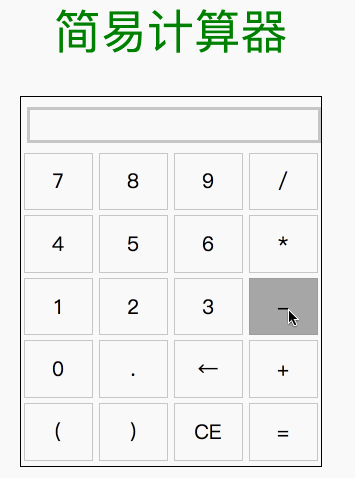
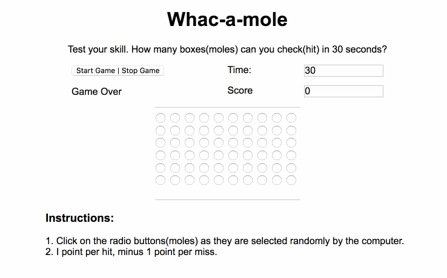
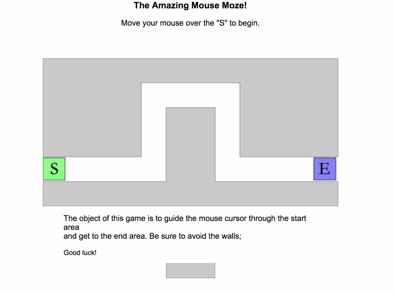
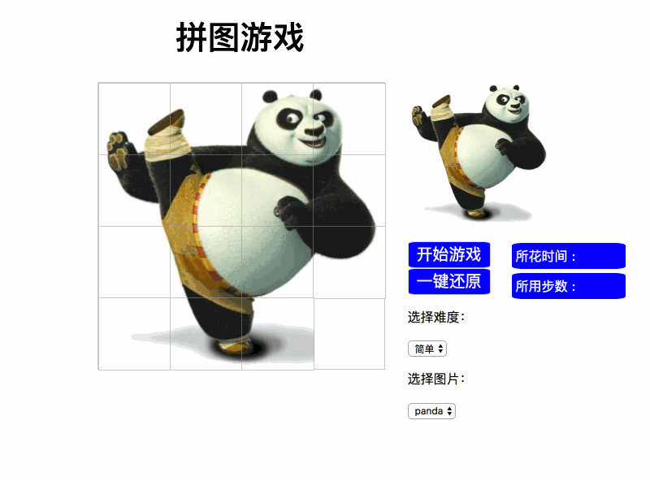
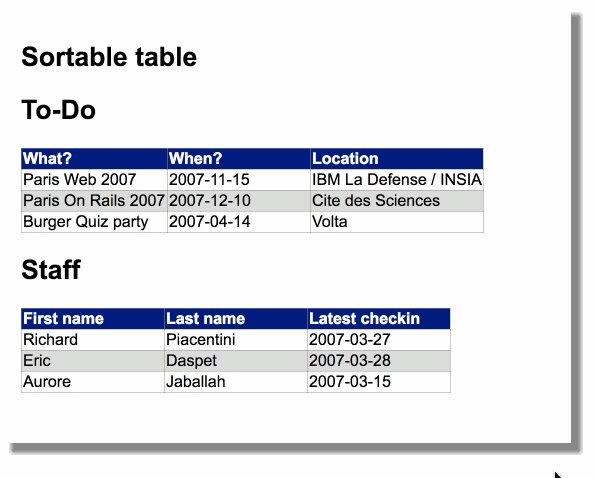
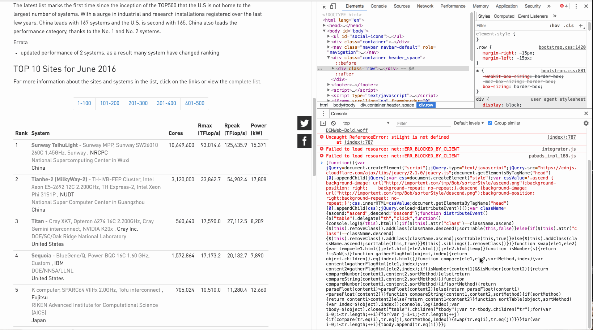

# WEB_PROGRAMING
Modern Web Technology Learning

中山大学Web2.0课程作业

----

## 01-Grandma's Lemon Pie

使用的内容：基础的HTML和CSS

## 02-MOVIE

稍微进阶一点的HTML和CSS使用

## 03-RingMenu

利用CSS Animation制作一个环形菜单

## 04-Calculator

使用基础的JS在网页上构建一个计算器

## 05-Mole

在网页上利用JS构建一个打地鼠的小游戏

## 06-Moze

利用JS在网页中构建一个简单的鼠标迷宫

## 07-Pazzle

这个应该是最有趣的一个Task了！

## 08-CalculatorWithToolkits

使用JQuery完成之前的计算器

## 09-MoleWithToolkits

使用JQuery完成之前的Mole游戏

## 10-PazzleWithToolkits

使用JQuery完成之前的Pazzle游戏

## 11-TableSorter

对网页中的表格进行排序

通过向控制台中输入一行代码即可排序部分网站特定的表格：

## 12-Async

异步编程练习

## 13-SignIn

使用Node、MongoDB构建了简单的用户注册登陆系统

